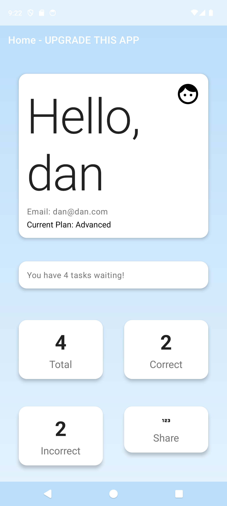
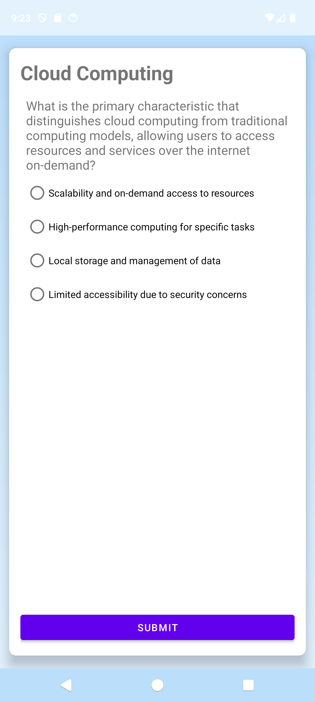
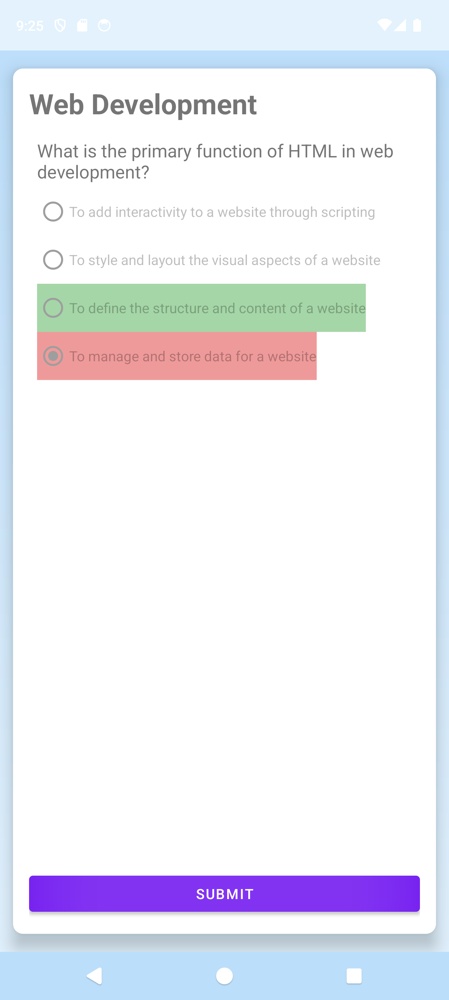
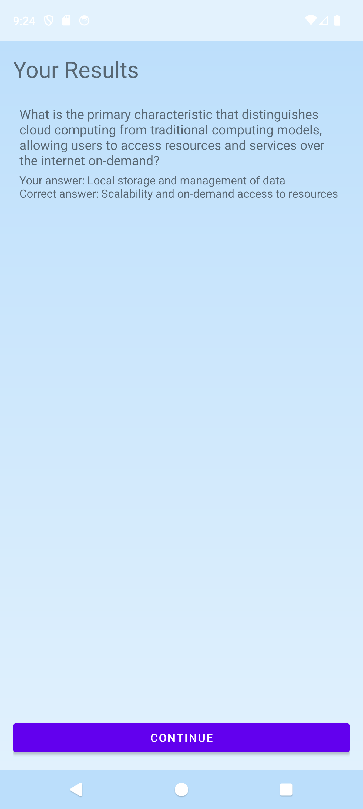
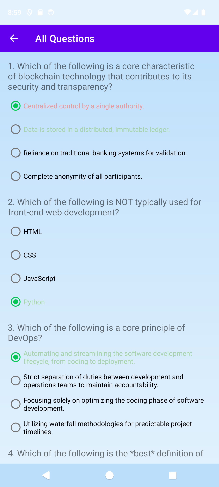
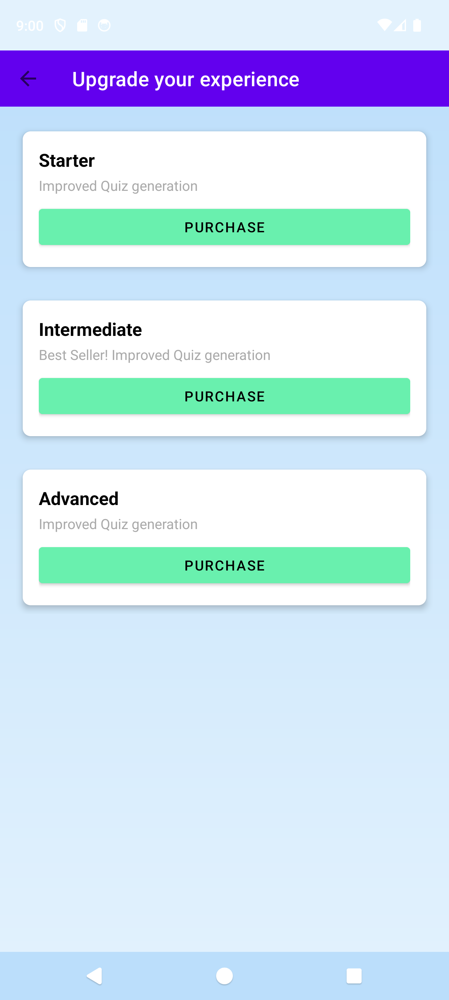
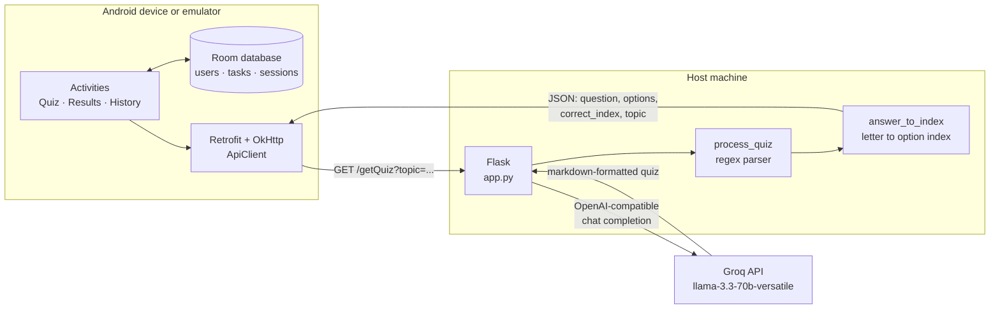

# LLM-Powered Quiz

An Android app that generates quizzes with a large language model, marks them, and
tracks your results. Pick your topics, get questions written on demand, answer
them, review every attempt.

Two halves in one repository: an **Android client** and a **Flask server** that
prompts the model and parses what comes back.

| | |
|---|---|
| **Client** | Java, Retrofit, Room — [`client/`](client) |
| **Server** | Python, Flask — [`server/`](server) |
| **Model** | `llama-3.3-70b-versatile` via Groq's free tier |
| **Licence** | MIT |

---

## It looks like this

| Sign in | Home | Pending quizzes |
|---|---|---|
|  |  |  |

| A question | Marked | Result |
|---|---|---|
|  |  |  |

Every question in these screenshots was generated by the model at the time of
capture — nothing is mocked or hand-written.

| History | Subscription tiers |
|---|---|
|  |  |

---

## How it works



The server asks the model for a question in a fixed markdown shape, then parses it
with a regular expression rather than trusting the model to emit JSON:

```
**QUESTION 1:** ...
**OPTION A:** ...
**OPTION B:** ...
**ANS:** B
```

`answer_to_index` turns that answer letter into the **0-based option index** the
Android client stores. That conversion is the seam between the two halves, and it
is where the interesting bug lived — see [Design notes](#design-notes).

---

## Running it

You need **JDK 17+**, the **Android SDK**, **Python 3.9+**, and a free
[Groq API key](https://console.groq.com/keys).

```bash
# 1. server
cp server/.env.example server/.env     # add your GROQ_API_KEY
make run                               # http://localhost:5000

# 2. client, in another terminal
make apk
adb install -r client/app/build/outputs/apk/debug/app-debug.apk
```

Then sign up in the app, pick topics on the Interests screen, and Home fetches a
quiz for each. The emulator reaches the server at `10.0.2.2:5000` — the alias for
your host's localhost — so no configuration is needed.

Check it is alive without the app:

```bash
curl 'http://localhost:5000/getQuiz?topic=Recursion'
```

### Other tasks

```bash
make check    # refuse to ship if a credential is committed - fast, no install
make test     # server test suite - 27 tests, no network, no key
make help     # everything else
```

---

## Design notes

### The client and server disagreed, and every quiz was marked wrong

The server sent the answer as a letter:

```json
{ "question": "...", "options": ["...", "..."], "correct_answer": "B" }
```

The Android model expects an integer:

```java
public int correct_index;   // nothing ever assigned it
```

Gson silently discards fields it does not recognise, so `correct_answer` was
dropped and `correct_index` kept its default of **0**. Every question was marked
as though option A were correct — and the wrong result was written into Room, so
it persisted. Four places consumed it: the answer colouring, the results screen,
history, and the history adapter.

Nothing was broken in either half on its own. The defect lived purely in the
contract between them, which is exactly what publishing them as two repositories
hid. **The fix is server-side and additive**: `correct_answer` is still sent, with
`correct_index` and `topic` added alongside it, so the client needed no change.

### Why Groq, when this was built against Hugging Face

It was originally written against the Hugging Face Inference API, which was free
with a daily request allowance. Hugging Face replaced that with *Inference
Providers* in 2025: `api-inference.huggingface.co` no longer resolves at all, and
free accounts get **$0.10 of credit a month**. Against a 27B model that is a
handful of quizzes, after which every request returns `402`.

The original URL also pinned a specific provider (`novita`) into the path. That
provider stopped serving the model, so the same URL began returning *"Model not
supported by provider novita"* — the server was dead through no fault of its own.

Groq's free tier serves `llama-3.3-70b-versatile` at 30 requests a minute and
speaks the same OpenAI-compatible dialect, so the prompt, parser and routes are
unchanged. **A demo nobody else can run is not a demo**, and that is the whole
reason for the switch.

The Hugging Face version is kept, working, at
[`server/variants/main-huggingface-router.py`](server/variants).

### Four ways to call a model

`server/variants/` holds the same server written four ways, because "how do you
actually call an LLM from a backend" has several answers with different trade-offs.
See [server/README.md](server/README.md) — the comparison is the point.

### Testing

27 tests on the server, run with `make test`. They drive the real Flask routes and
stub the model call, so they need no key and make no network request. Nothing in
`app.py` was reshaped to make it testable.

Every test was validated by **reintroducing the defect it covers** in a throwaway
copy and confirming it fails — eight mutations, all caught. A suite that has only
ever passed proves nothing. The same applies to `scripts/check-secrets.sh`, which
was verified by planting fake credentials in a throwaway repository.

---

## Known gaps

- **The Flask development server is single-process.** Correct for a demo, wrong
  for production.
- **Login does not check the password.** Accounts are local to the device; see
  [client/README.md](client/README.md).
- **No Android tests.** The client is verified by building and running it.
- **Failures are silent in the UI.** If the server is down or out of credit, Home
  simply shows no tasks. The server log says why; the app does not.
- **One question per quiz.** `app.py`'s prompt asks for one; the variants ask for
  three.
- **Payments are UI only.**
- **Sessions recorded before the answer-index fix keep the wrong answer.** There
  is no migration.

---

## Repository layout

```
├── client/           Android app
├── server/           Flask API, tests, and the four model-call variants
├── scripts/          check-secrets.sh
├── docs/screenshots/
├── Makefile
└── .github/workflows/ci.yml
```

CI runs two jobs: the fast deterministic checks and test suite, and the Android
build separately, so a flaky toolchain download cannot mask a real failure.

---

## Licence

MIT — see [LICENSE](LICENSE).

## Development notes

The design and the decisions in this repository are my own. I used Claude (Anthropic)
as an assistant while repairing and documenting it; commits carry an
`Assisted-by:` trailer where that applies.
